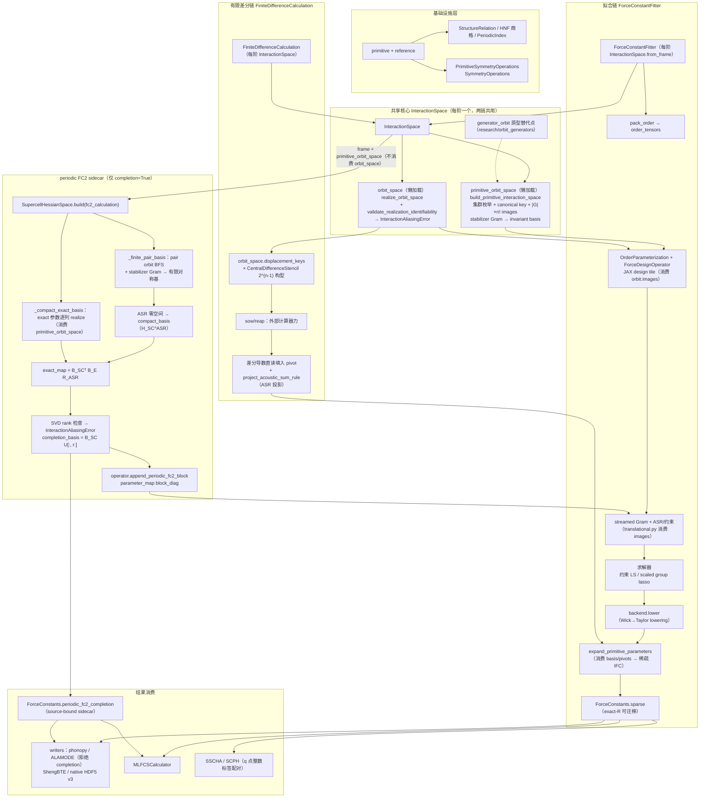

# MLFCS 调用消费链

## 总览

三条主链（拟合、有限差分、periodic FC2 sidecar）共享 `InteractionSpace` 的枚举产物。
分歧仅在"观测→参数"机制：拟合走 design + streamed Gram + 求解器反演；有限差分走
差分模板直读 + ASR 投影；periodic sidecar 只挂靠 fitter，且它消费 `InteractionSpace`
的 `frame` 与 `primitive_orbit_space`，不消费 `orbit_space`。

## 流程图

## 关键消费点

| 消费者 | 读的字段 | 位置 |
|---|---|---|
| ASR 约束 | `orbit.images` + `image.action` | `constraints/translational.py` |
| 参数化 / design | `orbits` / `dimension` / `images` | `fitting/parameterization.py`、`design_operator.py` |
| Gram 分块 | `orbit.dimension` | `fitting/gram_system.py` |
| Wick 跨阶 | `orbit.images` | `fitting/backends/wick/lowering.py` |
| IFC 展开 | `basis` / `pivots` | `force_constants/expansion.py` |
| periodic exact 映射 | `primitive_orbit_space` 逐列展开 | `force_constants/periodic_fc2.py` |
| FD 位移构型 | `pivots` → displacement_keys | `finite_difference/sampling.py` |
| FD 重构 | `pivots` 直读 + ASR | `finite_difference/reconstruction.py` |

## 要点

- 两条主链（拟合/差分）共享 `InteractionSpace` 的全部产物，分歧仅在观测→参数机制；
- periodic sidecar 只挂 fitter 的 Gram 阶段，且它自己又消费 `primitive_orbit_space`
  （exact 映射），即第三链建立在主链枚举产物之上，不消费 realize 后的 `orbit_space`；
- `generator_orbit` 原型（生成元 BFS + Schreier）的替代点只有一处：
  `build_primitive_interaction_space` 的 $|G| \times n!$ image 双重循环。
